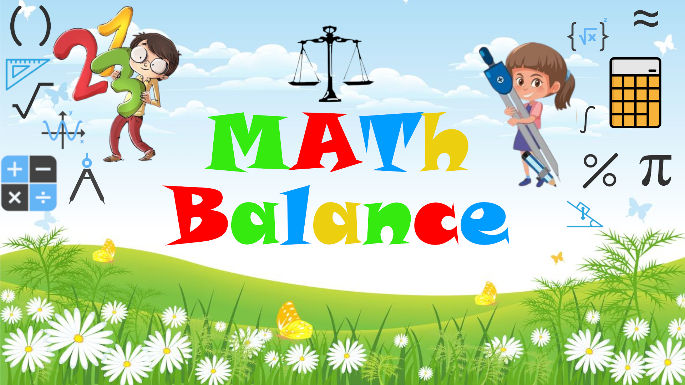
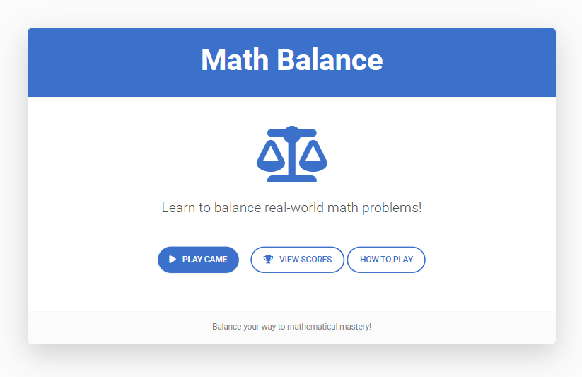
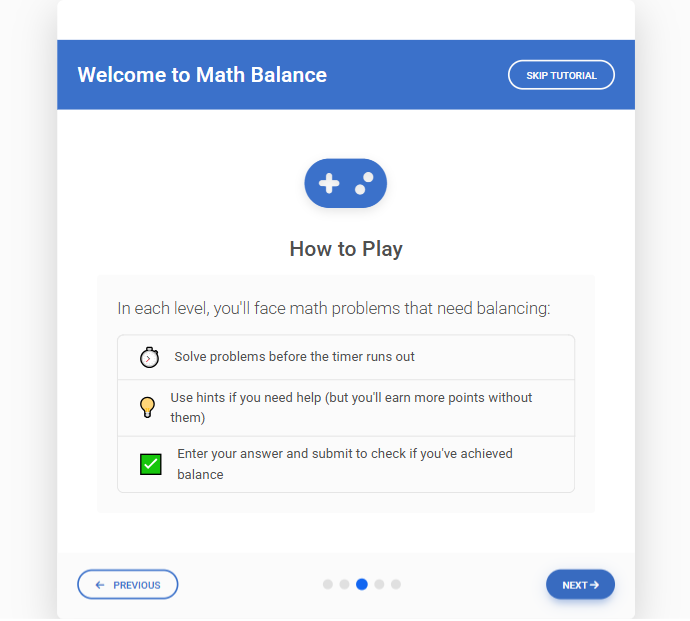
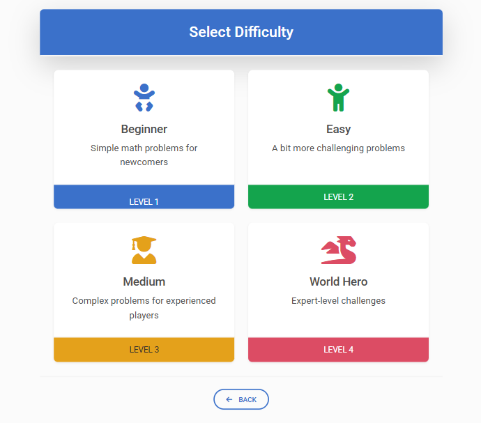
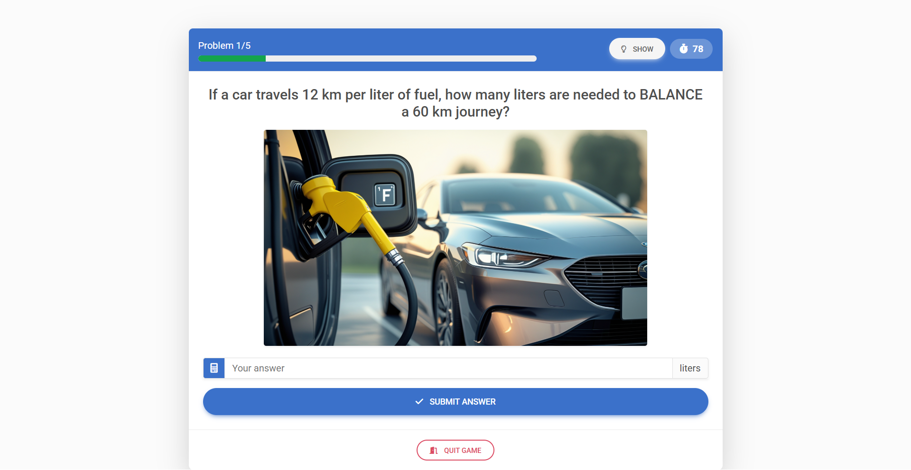

# Maths Balance



A game designed to teach the concept of balance in real-world mathematical problems, created for the GameDevJS Game Jam 2025 (April 13th - 26th).

## Table of Contents

- [Game Overview](#game-overview)
- [Screenshots](#screenshots)
- [Installation](#installation)
- [Running the Game](#running-the-game)
- [File Structure](#file-structure)
- [Editing the Game](#editing-the-game)
- [Contributing](#contributing)
- [License](#license)

## Game Overview

**Maths Balance** is an educational game that teaches players how mathematics helps us solve and balance real-world problems. The core concept revolves around demonstrating how every action requires an equal reaction or adjustment to maintain equilibrium.

Players will encounter a variety of scenarios across different difficulty levels (Beginner, Easy, Medium, and World Hero) where they must apply mathematical reasoning to achieve balance, including:

- Financial transactions and budgeting
- Physical forces and mechanical balance
- Chemical equations and reactions
- Resource allocation and distribution
- Environmental impact calculations

By solving these problems, players develop an intuitive understanding of how mathematics serves as a tool for creating and maintaining balance in everyday situations.

## Screenshots


*Example of a beginner-level balance problem*


*Player solving a medium difficulty challenge*


*World Hero challenge example*


*World Hero challenge example*

## Installation

### Prerequisites

- A modern web browser (Chrome, Firefox, Safari, or Edge)
- Optional: [Visual Studio Code](https://code.visualstudio.com/) with [Live Server extension](https://marketplace.visualstudio.com/items?itemName=ritwickdey.LiveServer) for local development

### Option 1: Clone the Repository (Recommended)

1. Install [Git](https://git-scm.com/downloads) if you haven't already
2. Open a terminal or command prompt
3. Run the following commands:
```bash
git clone https://github.com/Mavros-Lykos/MathsBalance-gamdevjs-2025.git
cd MathsBalance-gamdevjs-2025
```

### Option 2: Download ZIP

1. Visit the [repository page](https://github.com/yourusername/maths-balance)
2. Click the "Code" button and select "Download ZIP"
3. Extract the ZIP file to your preferred location

## Running the Game

### Recommended: MDB-Local Version

We recommend playing the MDB-Local version as it's properly configured and includes all required dependencies:

1. Navigate to the MDB-Local folder in the project directory
2. If you have Visual Studio Code with Live Server:
   - Open the folder in VS Code
   - Right-click on `index.html`
   - Select "Open with Live Server"
3. Alternatively, you can simply open the `index.html` file in your browser directly

### Alternative: Raw Version

The repository also contains raw versions of the game built with pure CSS (no frameworks):

1. Navigate to the project root directory
2. Open `index.html` in your browser

### Note on MDB-CDN Version and raw version

The MDB-CDN version and raw version is available but not fully configured yet. like not fully linked the images/sounds etc. small variations but can take as a template for your development. we will complete those versions as soon as possible. We recommend using the MDB-Local version for the best experience.

## File Structure

```
maths-balance/
├── index.html              # Raw version entry point
├── style.css               # Raw version styles
├── game.js                 # Raw version game logic
├── data.js                 # Raw version game data (questions,answers, hints etc.)
├── todo.md                 # Development notes and to-do list
├── MDB-CDN/                # Version using MDB via CDN (not fully configured)
│   ├── index.html          # CDN version entry point
│   ├── style.css           # CDN version styles
│   ├── data.js           # CDN version game data (questions,answers, hints etc.)
│   └── game.js             # CDN version game logic
├── MDB-Local/              # Version using local MDB files (recommended)
│   ├── index.html          # Local version entry point
│   ├── style.css           # Local version styles
│   ├── game.js             # Local version game logic
│   ├── data.js             # Local version game data (questions,answers, hints etc.)
│   ├── mdb.min.css         # MDB Bootstrap CSS
│   └── mdb.umd.min.js      # MDB Bootstrap JS
├── images/                 # Game images
│   ├── placeholder.png     # Default image when no specific image is available
│   ├── beginner/           # Beginner level problem images
│   ├── easy/               # Easy level problem images
│   ├── medium/             # Medium level problem images
│   ├── worldHero/          # World Hero level problem images
│   └── screenShots/        # Screenshots of the game
└── sounds/                 # Game audio files
```

## Editing the Game

### Required Tools

- Text editor or IDE (Visual Studio Code recommended)
- Basic knowledge of HTML, CSS, and JavaScript
- Understanding of MDB Bootstrap framework (for MDB versions)

### Modifying Content

#### Adding New Math Problems

1. Create an appropriate image for the problem (if needed) and place it in the corresponding difficulty folder under `images/`
2. Open `game.js` in the version you want to modify
3. Locate the problems array for the appropriate difficulty level
4. Add a new problem object with:
   - Question text
   - image
   - hint
   - answer
   - unit
   - explanation

Example:
```javascript
const beginnerProblems = [
  // Existing problems...
  {
            question: "Your $20 shirt is on sale with 25% off. To BALANCE what you get with what you pay, how much will you pay?",
            image: "../images/beginner/3_shirt.jpg",
            hint: "Balance equation: Original price × (1 - discount percentage) = Final price",
            answer: 15,
            unit: "$",
            explanation: "To balance the transaction, you pay $20 × (1 - 0.25) = $20 × 0.75 = $15."
        }
];
```

#### Modifying the User Interface

1. For style changes, edit the `style.css` file in your preferred version
2. For layout or structural changes, modify the `index.html` file
3. If working with the MDB versions, refer to the [MDB Bootstrap documentation](https://mdbootstrap.com/docs/) for component guidelines

#### Adding New Features

1. Make changes to the `game.js` file to implement new functionality
2. Test thoroughly across different browsers
3. Update this documentation if you add significant features

## Contributing

We welcome contributions to Maths Balance! Please see [CONTRIBUTING.md](CONTRIBUTING.md) for guidelines on how to contribute to the project.


## License

This game is licensed under the MIT License - see the [LICENSE](LICENSE.md) file for details.


# NOTICE

## Third-Party Software

This project includes or depends upon the following third-party software, subject to their respective licenses:

### Material Design for Bootstrap (MDB)

This project uses Material Design for Bootstrap (MDB), which is subject to its own license terms.

Website: https://mdbootstrap.com
License: https://mdbootstrap.com/general/license/

Depending on which MDB product you're using (FREE, PRO, etc.), different license terms may apply. Please ensure you are complying with the specific MDB license for your usage.